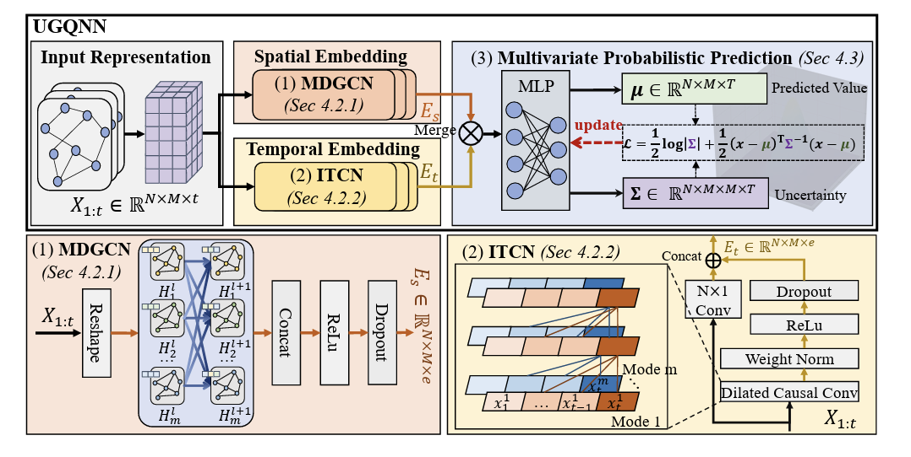
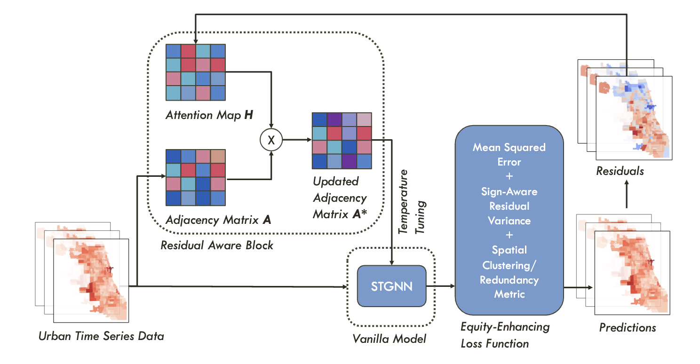
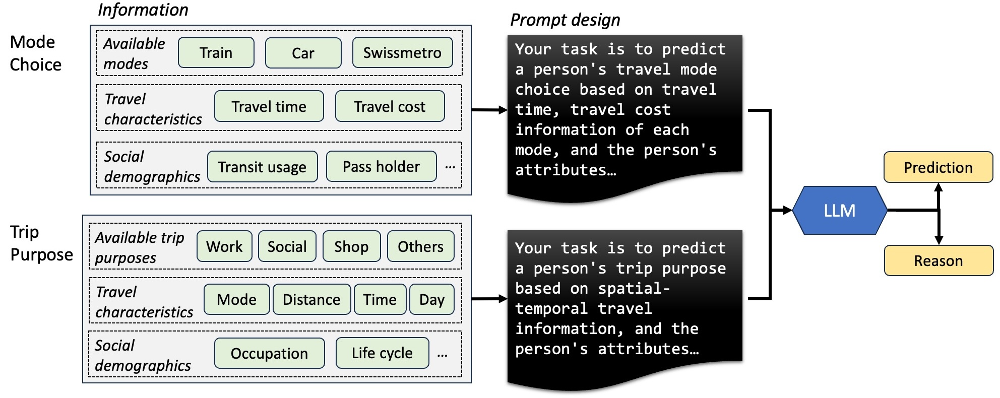
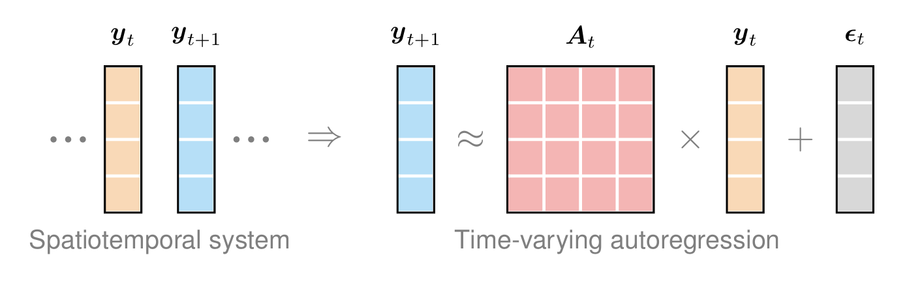
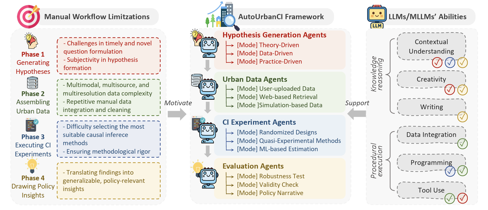
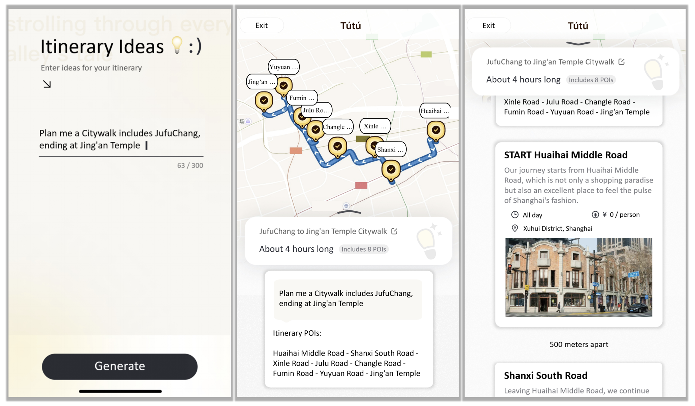
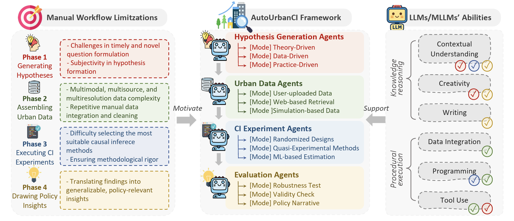
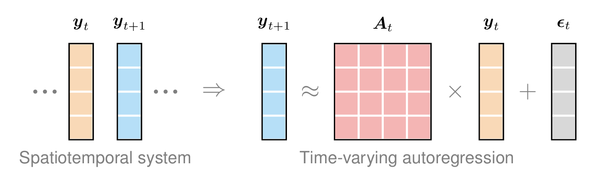

# Website Update Task

Working directory: ~/MIT Dropbox/Dingyi Zhuang/GoAbroad/GAU/Web/ZhuangDingyi.github.io

## TASK 1: Update biography in index.html

Find and REMOVE this outdated paragraph (remove the entire `<p class="intro_paragraph">` block containing "Bosch Center"):
```
I will join <a href="https://www.bosch-ai.com/">Bosch Center for Artificial Intelligence</a> as a summer intern in 2025.
Before that, I spent time doing researchs at ...
```

The paragraph to remove starts with "I will join" and ends with the closing `</p>` tag after "Singapore-MIT Alliance for Research and Technology (SMART)".

## TASK 2: Update Sparkle entry in index.html

Find the Sparkle entry (search for "Sparkle: Mastering Basic Spatial"). Update its venue from:
```html
<div class="media-box-conference">
  <strong><span class="paper_year">[IJCAI 2025]</i></strong></span></div>
```
to:
```html
<div class="media-box-conference">
  <strong><span class="paper_year">[EMNLP 2025]</i></strong></span></div> <span class="paper_conf"> Findings of the Association for Computational Linguistics: EMNLP 2025</span>
```

## TASK 3: Download teaser images

Run these curl commands to download thumbnail images to data/thumbnails/:

For arxiv papers, try to get first figure from HTML version. If fails, use fallback copy.

Commands to run:
```bash
cd "data/thumbnails"

# TrustEnergy - try arxiv HTML
IMG=$(curl -s "https://arxiv.org/html/2601.13422" | grep -oP '(?<=src=")[^"]*\.(png|jpg)' | grep -i "fig\|fig1\|figure\|teaser\|arch" | head -1)
if [ -n "$IMG" ]; then
  curl -sL "https://arxiv.org/html/2601.13422/$IMG" -o trustenergy.png 2>/dev/null || cp uqgnn.jpg trustenergy.png
else
  cp uqgnn.jpg trustenergy.png
fi

# For simplicity, just create placeholder copies for all new papers
cp raa.png rast_moe.png
cp llm_mp.jpg think_drive.png
cp datf.png timepre.png
cp urbanci.png alphaopt.png
cp itenera.png uam_framework.png
cp urbanci.png genai_urban.png
cp genai_urban.png humanform.png
cp datf.png foundation_st.png
```

Actually just run these simple copy commands for placeholders:
```bash
cd "data/thumbnails"
cp uqgnn.jpg trustenergy.png
cp raa.png rast_moe.png  
cp llm_mp.jpg think_drive.png
cp datf.png timepre.png
cp urbanci.png alphaopt.png
cp itenera.png uam_framework.png
cp urbanci.png genai_urban.png
cp genai_urban.png humanform.png
cp datf.png foundation_st.png
```

## TASK 4: Insert new paper entries in index.html

In index.html, find the line:
```
<table id="publications-table"
```
and then find the FIRST `<tr class="paper_entry"` after it. Insert these 9 new entries RIGHT BEFORE that first `<tr class="paper_entry"` tag.

### Entry 1: TrustEnergy (2026)
```html
          <tr class="paper_entry" 
          data-year="2026"
          data-topic="st uq"
          data-selected="false"
          id="trustenergy">
            <td class="paper_tb">
              <div class="tb_one">
                <div class="tb_two">
                  
                </div>
              </div>
            </td>
            <td class="paper_details">
              <a target="_blank" href="https://arxiv.org/abs/2601.13422">
                <papertitle>TrustEnergy: A Unified Framework for Accurate and Reliable User-level Energy Usage Prediction</papertitle>
              </a>
              <br>             
              Dahai Yu,
              Rongchao Xu,
              <strong class="wrap">Dingyi Zhuang</strong>,
              <a class="wrap" target="_blank" href="https://buyuheng.github.io/">Yuheng Bu</a>,
              <a class="wrap" target="_blank" href="https://www.urbanailab.com/">Shenhao Wang</a>,
              <a class="wrap" target="_blank" href="https://guangwang.me/#/home">Guang Wang</a>
              <br>
              <div class="media-box-conference">
              <strong><span class="paper_year">Under Review</span></strong></div> <span class="paper_year">2026</span>
              <br>                            
              <a class="wrap" target="_blank" href="https://arxiv.org/abs/2601.13422"><i class="fa fa-file"></i> arXiv</a> |
              <div class="wrap topic-circle st-color"></div>
              <div class="wrap topic-circle uq-color"></div>
            </td>
          </tr>
```

### Entry 2: RAST-MoE-RL (2025)
```html
          <tr class="paper_entry" 
          data-year="2025"
          data-topic="tp st"
          data-selected="false"
          id="rast_moe">
            <td class="paper_tb">
              <div class="tb_one">
                <div class="tb_two">
                  
                </div>
              </div>
            </td>
            <td class="paper_details">
              <a target="_blank" href="https://arxiv.org/abs/2512.13727">
                <papertitle>RAST-MoE-RL: A Regime-Aware Spatio-Temporal MoE Framework for Deep Reinforcement Learning in Ride-Hailing</papertitle>
              </a>
              <br>             
              Yuhan Tang, Kangxin Cui, Jung Ho Park, Yibo Zhao, Xuan Jiang, Haoze He,
              <strong class="wrap">Dingyi Zhuang</strong>,
              <a class="wrap" target="_blank" href="https://www.urbanailab.com/">Shenhao Wang</a>,
              Jiangbo Yu,
              <a class="wrap" target="_blank" href="https://coe.northeastern.edu/people/koutsopoulos-haris/">Haris Koutsopoulos</a>,
              <a class="wrap" target="_blank" href="https://dusp.mit.edu/people/jinhua-zhao">Jinhua Zhao</a>
              <br>
              <div class="media-box-conference">
              <strong><span class="paper_year">Under Review</span></strong></div> <span class="paper_year">2025</span>
              <br>                            
              <a class="wrap" target="_blank" href="https://arxiv.org/abs/2512.13727"><i class="fa fa-file"></i> arXiv</a> |
              <div class="wrap topic-circle tp-color"></div>
              <div class="wrap topic-circle st-color"></div>
            </td>
          </tr>
```

### Entry 3: Think Before You Drive (2025)
```html
          <tr class="paper_entry" 
          data-year="2025"
          data-topic="llm tp"
          data-selected="false"
          id="think_drive">
            <td class="paper_tb">
              <div class="tb_one">
                <div class="tb_two">
                  
                </div>
              </div>
            </td>
            <td class="paper_details">
              <a target="_blank" href="https://arxiv.org/abs/2512.03454">
                <papertitle>Think Before You Drive: World Model-Inspired Multimodal Grounding for Autonomous Vehicles</papertitle>
              </a>
              <br>             
              Haicheng Liao, Huanming Shen, Bonan Wang, Yongkang Li,
              <a class="wrap" target="_blank" href="https://yihongt.github.io/">Yihong Tang</a>,
              Chengyue Wang,
              <strong class="wrap">Dingyi Zhuang</strong>,
              Kehua Chen, Hai Yang, Chengzhong Xu, Zhenning Li
              <br>
              <div class="media-box-conference">
              <strong><span class="paper_year">Under Review</span></strong></div> <span class="paper_year">2025</span>
              <br>                            
              <a class="wrap" target="_blank" href="https://arxiv.org/abs/2512.03454"><i class="fa fa-file"></i> arXiv</a> |
              <div class="wrap topic-circle llm-color"></div>
              <div class="wrap topic-circle tp-color"></div>
            </td>
          </tr>
```

### Entry 4: TimePre (2025)
```html
          <tr class="paper_entry" 
          data-year="2025"
          data-topic="st uq"
          data-selected="false"
          id="timepre">
            <td class="paper_tb">
              <div class="tb_one">
                <div class="tb_two">
                  
                </div>
              </div>
            </td>
            <td class="paper_details">
              <a target="_blank" href="https://arxiv.org/abs/2511.18539">
                <papertitle>TimePre: Bridging Accuracy, Efficiency, and Stability in Probabilistic Time-Series Forecasting</papertitle>
              </a>
              <br>             
              Lingyu Jiang, Lingyu Xu,
              <a class="wrap" target="_blank" href="https://scholar.google.com/citations?user=dij7O7IAAAAJ&hl=en">Peiran Li</a>,
              Qianwen Ge,
              <strong class="wrap">Dingyi Zhuang</strong>,
              Shuo Xing, Wenjing Chen, Xiangbo Gao, Ting-Hsuan Chen
              <br>
              <div class="media-box-conference">
              <strong><span class="paper_year">Under Review</span></strong></div> <span class="paper_year">2025</span>
              <br>                            
              <a class="wrap" target="_blank" href="https://arxiv.org/abs/2511.18539"><i class="fa fa-file"></i> arXiv</a> |
              <div class="wrap topic-circle st-color"></div>
              <div class="wrap topic-circle uq-color"></div>
            </td>
          </tr>
```

### Entry 5: AlphaOPT (2025)
```html
          <tr class="paper_entry" 
          data-year="2025"
          data-topic="llm"
          data-selected="false"
          id="alphaopt">
            <td class="paper_tb">
              <div class="tb_one">
                <div class="tb_two">
                  
                </div>
              </div>
            </td>
            <td class="paper_details">
              <a target="_blank" href="https://arxiv.org/abs/2510.18428">
                <papertitle>AlphaOPT: Formulating Optimization Programs with Self-Improving LLM Experience Library</papertitle>
              </a>
              <br>             
              Mingkai Kong,
              <a class="wrap" target="_blank" href="https://scholar.google.com/citations?user=HiPCZxEAAAAJ">Ao Qu</a>,
              Xuan Guo, Wanxin Ouyang, Chonghe Jiang, Huiyu Zheng, Yanxin Ma,
              <strong class="wrap">Dingyi Zhuang</strong>
              <br>
              <div class="media-box-conference">
              <strong><span class="paper_year">Under Review</span></strong></div> <span class="paper_year">2025</span>
              <br>                            
              <a class="wrap" target="_blank" href="https://arxiv.org/abs/2510.18428"><i class="fa fa-file"></i> arXiv</a> |
              <div class="wrap topic-circle llm-color"></div>
            </td>
          </tr>
```

### Entry 6: UAM Framework (2025)
```html
          <tr class="paper_entry" 
          data-year="2025"
          data-topic="tp st"
          data-selected="false"
          id="uam_framework">
            <td class="paper_tb">
              <div class="tb_one">
                <div class="tb_two">
                  
                </div>
              </div>
            </td>
            <td class="paper_details">
              <a target="_blank" href="https://arxiv.org/abs/2510.04186">
                <papertitle>From Patchwork to Network: A Comprehensive Framework for Demand Analysis and Fleet Optimization of Urban Air Mobility</papertitle>
              </a>
              <br>             
              <a class="wrap" target="_blank" href="https://dl.acm.org/profile/99661118843">Xinke Jiang</a>,
              Xishan Zhou, Yibo Zhao, Sirui Cao,
              <strong class="wrap">Dingyi Zhuang</strong>,
              <a class="wrap" target="_blank" href="https://dusp.mit.edu/people/jinhua-zhao">Jinhua Zhao</a>,
              <a class="wrap" target="_blank" href="https://coe.northeastern.edu/people/koutsopoulos-haris/">Haris Koutsopoulos</a>
              <br>
              <div class="media-box-conference">
              <strong><span class="paper_year">Under Review</span></strong></div> <span class="paper_year">2025</span>
              <br>                            
              <a class="wrap" target="_blank" href="https://arxiv.org/abs/2510.04186"><i class="fa fa-file"></i> arXiv</a> |
              <div class="wrap topic-circle tp-color"></div>
              <div class="wrap topic-circle st-color"></div>
            </td>
          </tr>
```

### Entry 7: Generative AI for Urban Design (2025)
```html
          <tr class="paper_entry" 
          data-year="2025"
          data-topic="llm"
          data-selected="false"
          id="genai_urban">
            <td class="paper_tb">
              <div class="tb_one">
                <div class="tb_two">
                  
                </div>
              </div>
            </td>
            <td class="paper_details">
              <a target="_blank" href="https://arxiv.org/abs/2505.24260">
                <papertitle>Generative AI for Urban Design: A Stepwise Approach Integrating Human Expertise with Multimodal Diffusion Models</papertitle>
              </a>
              <br>             
              Mengyi He, Yuxuan Liang,
              <a class="wrap" target="_blank" href="https://www.urbanailab.com/">Shenhao Wang</a>,
              Yunhan Zheng, Qingyi Wang,
              <strong class="wrap">Dingyi Zhuang</strong>,
              Longxu Tian,
              <a class="wrap" target="_blank" href="https://dusp.mit.edu/people/jinhua-zhao">Jinhua Zhao</a>
              <br>
              <div class="media-box-conference">
              <strong><span class="paper_year">Under Review</span></strong></div> <span class="paper_year">2025</span>
              <br>                            
              <a class="wrap" target="_blank" href="https://arxiv.org/abs/2505.24260"><i class="fa fa-file"></i> arXiv</a> |
              <div class="wrap topic-circle llm-color"></div>
            </td>
          </tr>
```

### Entry 8: Human-guided Urban Form (Building & Environment 2025)
```html
          <tr class="paper_entry" 
          data-year="2025"
          data-topic="llm"
          data-selected="false"
          id="humanform">
            <td class="paper_tb">
              <div class="tb_one">
                <div class="tb_two">
                  
                </div>
              </div>
            </td>
            <td class="paper_details">
              <a target="_blank" href="https://doi.org/10.1016/j.buildenv.2025.113892">
                <papertitle>Human-guided Urban Form Generation Using Multimodal Diffusion Models</papertitle>
              </a>
              <br>             
              Mengyi He, Yuxuan Liang,
              <a class="wrap" target="_blank" href="https://www.urbanailab.com/">Shenhao Wang</a>,
              Yunhan Zheng, Qingyi Wang,
              <strong class="wrap">Dingyi Zhuang</strong>,
              Longxu Tian,
              <a class="wrap" target="_blank" href="https://dusp.mit.edu/people/jinhua-zhao">Jinhua Zhao</a>
              <br>
              <div class="media-box-conference">
              <strong><span class="paper_year">[Building &amp; Environment]</span></strong></div> <span class="paper_conf"> Building and Environment</span> <span class="paper_year">2025</span>
              <br>                            
              <div class="wrap topic-circle llm-color"></div>
            </td>
          </tr>
```

### Entry 9: Foundation Model for ST (SSTD 2025)
```html
          <tr class="paper_entry" 
          data-year="2025"
          data-topic="st"
          data-selected="false"
          id="foundation_st">
            <td class="paper_tb">
              <div class="tb_one">
                <div class="tb_two">
                  
                </div>
              </div>
            </td>
            <td class="paper_details">
              <a target="_blank" href="https://dl.acm.org/doi/10.1145/3707872.3708017">
                <papertitle>Towards Foundation Model for Spatiotemporal Data Analysis</papertitle>
              </a>
              <br>             
              <a class="wrap" target="_blank" href="https://kaimaoge.github.io/">Yuankai Wu</a>,
              <a class="wrap" target="_blank" href="https://xinychen.github.io/">Xinyu Chen</a>,
              <strong class="wrap">Dingyi Zhuang</strong>
              <br>
              <div class="media-box-conference">
              <strong><span class="paper_year">[SSTD 2025]</span></strong></div> <span class="paper_conf"> International Symposium on Spatial and Temporal Data</span> <span class="paper_year">2025</span>
              <br>
              <div class="wrap topic-circle st-color"></div>
            </td>
          </tr>
```

## TASK 5: Add News Items

In index.html, find the comment `<!-- News Items -->` and insert these 3 items right after it (before the existing first news `<tr>`):

```html
              <tr>
                <td class="news_date1">Jan</td>
                <td class="news_date2">2026</td>
                <td class="news_details">                  
                  Paper "TrustEnergy: A Unified Framework for Accurate and Reliable User-level Energy Usage Prediction" submitted to arXiv.
                </td>
              </tr>
              <tr>
                <td class="news_date1">Jun</td>
                <td class="news_date2">2025</td>
                <td class="news_details">                  
                  Paper "Human-guided Urban Form Generation Using Multimodal Diffusion Models" accepted at <strong>Building and Environment</strong>.
                </td>
              </tr>
              <tr>
                <td class="news_date1">May</td>
                <td class="news_date2">2025</td>
                <td class="news_details">                  
                  Paper "Sparkle: Mastering Basic Spatial Capabilities in Vision Language Models" accepted at <strong>EMNLP 2025 (Findings)</strong>.
                </td>
              </tr>
```

## TASK 6: Git commit and push

```bash
git add -A
git commit -m "Update publications: add 9 new papers, fix Sparkle venue, update bio"
git push origin master || git push origin main
```

## TASK 7: Remove job market notice

In index.html, find and completely REMOVE this entire `<p class="intro_paragraph">` block:
```
<p class="intro_paragraph">
  <div class="media-box">
  <i><span style="color: red;">[New]</span> I am on the 2025–2026 job market. Looking for Research Scientist or tenure-track Assistant Professor positions.
    If you know of a relevant opportunity, feel free to get in touch. </i>
</div>
```
Remove the whole block including the closing `</p>` tag after the `</div>`.

## Summary
After completing all tasks, run: openclaw system event --text "Done: Website updated with 9 new papers pushed to GitHub" --mode now
