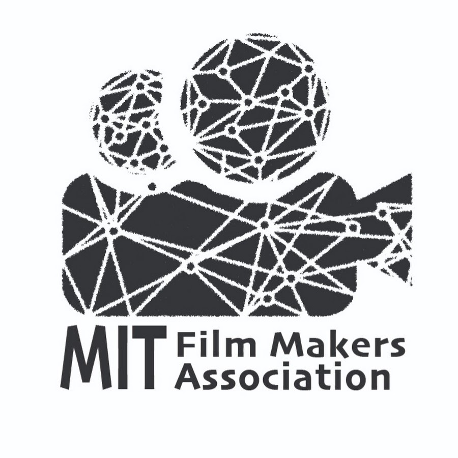

## After-school activities
  

 

**President of Student Advisory Team**, [MIT JTL Urban Mobility Lab](https://mobility.mit.edu/)
 
 

  
 

**Vice president of publicity**, [MIT Film Makers Association](https://filmmakers.mit.edu/)
 
 

  
 

**Vice president**, Center of Quality Development at Shanghai Jiao Tong University 

I have spent much time in student's affairs, especially hosting scholarship ceremonies and anniversaries of college, photographing and filming. Here are selected activities:

* I participated in hosting the 121th Anniversary of Shanghai Jiao Tong University, particularly in arranging the designing of shirts, posts and booklets.
* I have directed film trilogy to introduce Shanghai Jiao Tong University to freshmen: 
	* [A Bite of SJTU](https://v.youku.com/v_show/id_XMTY5NjkzMTE2NA==.html?spm=a2h0k.11417342.soresults.dtitle)  
	* [Our Love Story: A Disguised Introduction of Course Choosing](https://www.bilibili.com/video/av5993224/)  
	* [Fighting! My Dragon Soul](https://v.youku.com/v_show/id_XMTY5ODI5NjA2MA==.html?spm=a2h0k.11417342.soresults.dtitle)  

## Volunteer
* Dongchuan Road Subway Station (2018.5)
* Photographer volunteer for UAES-SJTU Collaboration Agreement Signing Ceremony (2017.8)
* Outstanding volunteer for 122th Anniversary of School of Mechanical Engineering, Shanghai Jiao Tong University (2018.4)
* 20th Anniversary of School of Life Science and Biotechnology of Shanghai Jiao Tong University (2017.11)
* Outstanding volunteer for 121th Anniversary of School of Mechanical Engineering, Shanghai Jiao Tong University (2017.4)
* Shanghai International Marathon (2016.9)

## Hobbies

* Film, animation and book. My favorites are [*Godfather*](https://www.imdb.com/title/tt0068646/) , [*Attack On Titan*](https://www.imdb.com/title/tt2560140/) and [*Napoleon by Emil Ludwig*](https://www.goodreads.com/book/show/129399.Napoleon) respectively

* [Photography in Flicker](https://www.flickr.com/gp/184583888@N05/Gp413b)

* Guitar player

* Strategic gameplays
